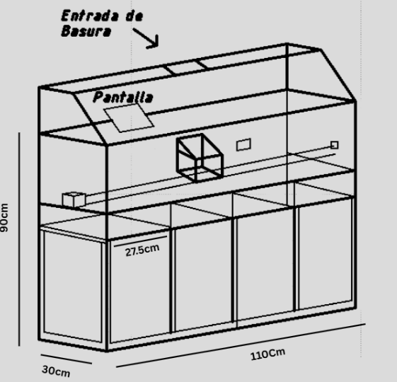

# Cesto Inteligente: Clasificación Automatizada de Desechos con IA

 ## Descripción General

Este proyecto implementa un cesto de basura inteligente capaz de clasificar automáticamente los desechos en tiempo real. Utiliza una **Raspberry Pi 4 B+**, una cámara, y un modelo de **Inteligencia Artificial (YOLOv8)** para identificar cuatro categorías de residuos: **Metal, Vidrio, Plástico y Cartón**. Una vez clasificado, un mecanismo accionado por **motores paso a paso** (controlados por drivers **A4988**) dirige el residuo al compartimento correspondiente dentro del cesto. El sistema cuenta con una interfaz gráfica de usuario (GUI) desarrollada con Tkinter para visualizar el proceso.

Este proyecto fue desarrollado como parte de las asignaturas Tecnología III, Práctica III y Laboratorio de Creatividad III, bajo la supervisión del docente Melquisidec Pérez Ramírez.

## Funcionalidades Principales

* **Clasificación Automática:** Identifica 4 categorías de residuos (Metal, Vidrio, Plástico, Cartón) usando un modelo YOLOv8 entrenado a medida.
* **Separación Mecanizada:** Utiliza motores paso a paso controlados directamente por la Raspberry Pi (vía drivers A4988) para dirigir los desechos al contenedor correcto.
* **Procesamiento en Tiempo Real:** Captura y analiza el video de la cámara en tiempo real.
* **Interfaz Gráfica (GUI):** Muestra la imagen de la cámara, la detección actual, el bounding box, la clase predicha, y una imagen de ejemplo del material detectado.

## Requisitos de Hardware

* **Computadora Principal:** Raspberry Pi 4 Modelo B+ (o superior)
* **Cámara:** Módulo de Cámara para Raspberry Pi (v2, HQ, o compatible USB)
* **Motores:** Motores Paso a Paso (ej. NEMA 17) - El número depende del diseño del mecanismo.
* **Drivers de Motor:** Drivers A4988 (uno por motor).
* **Fuente de Alimentación:**
    * Fuente de alimentación para Raspberry Pi (5V, >=3A, USB-C).
    * Fuente de alimentación **separada** y adecuada para los motores paso a paso y los drivers A4988 (ej. 12V-24V, corriente según motores). **¡IMPORTANTE: Conectar GND de ambas fuentes!**
* **Cableado:** Cables Dupont, protoboard (opcional), conectores.
* **Estructura del Cesto:** Contenedor principal, compartimentos internos, mecanismo de clasificación (ej. plataforma giratoria, brazo desviador).

## Requisitos de Software

* **Sistema Operativo:** Raspberry Pi OS (o una distribución Linux compatible)
* **Lenguaje:** Python 3.7+
* **Librerías Principales (ver `requirements.txt`):**
    * `ultralytics`: Para el modelo YOLOv8.
    * `opencv-python`: Para procesamiento de imágenes y video.
    * `RPi.GPIO`: Para controlar los pines GPIO y los drivers A4988.
    * `Pillow`: Para manejo de imágenes en Tkinter.
    * `numpy`: Para operaciones numéricas (usado por OpenCV).
    * `imutils`: Para utilidades de OpenCV (resize).
    * `tkinter`: (Generalmente incluido con Python) Para la GUI.
* **Base de datos (para interfaz web):**
    * `MySQL`: Base de datos para almacenar historial de detecciones y niveles de llenado.

## Estructura del Proyecto

```
Cesto_Inteligente_Proyecto/
│
├── main.py                 # Script principal (GUI, Inferencia, Orquestación)
├── train_yolo.py           # Script para entrenar el modelo YOLO
├── motor_controller.py     # Módulo para la lógica de control del motor paso a paso
├── main_web_adapter.py     # Módulo para comunicación con la interfaz web
├── requirements.txt        # Lista de dependencias de Python
├── README.md               # Este archivo
│
├── dataset_basura/         # Carpeta del dataset para YOLO (formato YOLO)
│   ├── data.yaml           # Archivo de configuración del dataset
│   ├── images/
│   │   ├── train/
│   │   └── val/
│   └── labels/
│       ├── train/
│       └── val/
│
├── models/                 # Modelos YOLO entrenados listos para usar
│   └── best.pt             # El mejor modelo resultante del entrenamiento
│
├── ui_assets/              # Recursos gráficos para la interfaz Tkinter
│   ├── Canva.png
│   └── ... (otras imágenes)
│
├── cesto_web/              # Interfaz web (opcional)
│   ├── backend/            # Servidor Flask para la interfaz web
│   └── frontend/           # Interfaz web (HTML, CSS, JS)
│
├── docs/                   # (Opcional) Documentación adicional
│   └── Cesto_inteligente_Avance_2.docx
│   └── esquema_conexiones.png
│
└── runs/                   # Carpeta generada por YOLO durante el entrenamiento
    └── ...
```

## Instalación y Configuración

1.  **Clonar el Repositorio:**
    ```bash
    git clone <URL_DEL_REPOSITORIO> # Reemplaza con la URL de tu repo Git
    cd Cesto_Inteligente_Proyecto
    ```

2.  **Configurar Entorno Python:** (Recomendado usar un entorno virtual)
    ```bash
    python3 -m venv venv
    source venv/bin/activate  # En Linux/macOS
    # venv\Scripts\activate   # En Windows
    ```

3.  **Instalar Dependencias:**
    ```bash
    pip install -r requirements.txt
    ```
    *Nota: La instalación de `ultralytics` y `opencv-python` puede tomar tiempo.*

4.  **Conexiones de Hardware:**
    * Conecta la cámara a la Raspberry Pi. Asegúrate de habilitarla usando `sudo raspi-config` si es un módulo CSI.
    * **¡CRÍTICO!** Conecta los pines `DIR`, `STEP`, `ENABLE` (si se usa) y `GND` de cada driver A4988 a los pines GPIO correspondientes de la Raspberry Pi. **Verifica y actualiza** las definiciones `DIR_PIN`, `STEP_PIN`, `ENABLE_PIN` dentro del archivo `motor_controller.py` para que coincidan con tus conexiones exactas.
    * Conecta la salida del A4988 (1A, 1B, 2A, 2B) al motor paso a paso correspondiente.
    * Conecta la fuente de alimentación de los motores a los pines `VMOT` y `GND` del A4988.
    * Conecta el pin `VDD` del A4988 a un pin de 3.3V o 5V de la Raspberry Pi (para la lógica del driver).
    * **¡MUY IMPORTANTE!** Conecta el pin `GND` de la fuente de alimentación del motor al pin `GND` de la Raspberry Pi para tener una referencia de tierra común.

5.  **Configurar Parámetros:**
    * **Pines GPIO:** Edita `motor_controller.py` y ajusta `DIR_PIN`, `STEP_PIN`, `ENABLE_PIN`, `USE_ENABLE`.
    * **Velocidad Motor:** Ajusta `STEP_DELAY` en `motor_controller.py`.
    * **Mapeo de Posiciones:** Edita `main.py` y ajusta el diccionario `TARGET_STEPS_MAP` para que el número de pasos corresponda a las posiciones físicas de tus contenedores. Ajusta también `HOME_POSITION_STEPS`.
    * **Tiempos:** Ajusta `DROP_DELAY` en `main.py` según sea necesario.

6.  **Configurar Base de Datos (para interfaz web):**
    * Instalar MySQL Server:
      ```bash
      # En Raspberry Pi OS / Debian / Ubuntu
      sudo apt update
      sudo apt install mysql-server
      
      # Iniciar y habilitar el servicio
      sudo systemctl start mysql
      sudo systemctl enable mysql
      ```
    * Configurar la base de datos:
      ```bash
      sudo mysql
      ```
      ```sql
      CREATE DATABASE cesto_inteligente_db;
      CREATE USER 'cesto_user'@'localhost' IDENTIFIED BY 'cesto_password';
      GRANT ALL PRIVILEGES ON cesto_inteligente_db.* TO 'cesto_user'@'localhost';
      FLUSH PRIVILEGES;
      EXIT;
      ```
    * Verificar la conexión a la base de datos:
      ```bash
      mysql -u cesto_user -p cesto_inteligente_db
      # Introducir contraseña: cesto_password
      ```
    * Para modificar las credenciales de conexión, edita el archivo `cesto_web/backend/.env`

## Preparación del Dataset

* Para entrenar tu propio modelo, necesitas un dataset de imágenes en la carpeta `dataset_basura/` siguiendo el formato YOLO:
    * `dataset_basura/images/train/`: Imágenes de entrenamiento.
    * `dataset_basura/images/val/`: Imágenes de validación.
    * `dataset_basura/labels/train/`: Archivos `.txt` con las anotaciones (clase x_center y_center width height) para cada imagen de entrenamiento.
    * `dataset_basura/labels/val/`: Archivos `.txt` con las anotaciones para validación.
    * `dataset_basura/data.yaml`: Archivo que define las rutas a `train`/`val`, el número de clases (`nc: 4`), y los nombres de las clases (`names: ['Metal', 'Glass', 'Plastic', 'Carton']`). **El orden en `names` debe coincidir con el usado en `TARGET_STEPS_MAP` en `main.py`**.

## Entrenamiento del Modelo (Opcional)

* Si has preparado tu propio dataset, puedes entrenar el modelo ejecutando:
    ```bash
    python train_yolo.py --data dataset_basura/data.yaml --epochs 100 --imgsz 640 --model yolov8n.pt --name CestoInteligente_Train
    ```
    * Ajusta los parámetros (`epochs`, `imgsz`, `model`, `name`) según sea necesario.
* Una vez finalizado el entrenamiento, copia el mejor modelo generado (`runs/detect/CestoInteligente_Train/weights/best.pt`) a la carpeta `models/best.pt`.

## Uso

1.  **Activar Entorno Virtual:**
    ```bash
    source venv/bin/activate
    ```
2.  **Ejecutar la Aplicación Principal:**
    Es probable que necesites permisos de superusuario para acceder a los pines GPIO.
    ```bash
    sudo python main.py
    ```
3.  La interfaz gráfica debería aparecer, mostrando la vista de la cámara. Coloca un residuo frente a la cámara y el sistema debería clasificarlo y mover el mecanismo.
4.  Para detener la aplicación, cierra la ventana de la GUI o presiona `Ctrl+C` en la terminal. El programa intentará limpiar los pines GPIO al salir.

## Interfaz Web (Opcional)

1.  **Iniciar el Backend:**
    ```bash
    cd cesto_web/backend
    python app.py
    ```
    El servidor se iniciará en `http://0.0.0.0:5000` por defecto.

2.  **Acceder a la Interfaz Web:**
    Abre un navegador y visita:
    - En la Raspberry Pi: `http://localhost:5000`
    - Desde otro dispositivo en la misma red: `http://<IP-DE-RASPBERRY>:5000`

3.  **Requisitos Específicos:**
    Asegúrate de tener instalados los paquetes adicionales para la interfaz web:
    ```bash
    pip install flask flask-socketio eventlet mysql-connector-python python-dotenv
    ```

## Licencia

Este proyecto se distribuye bajo la Licencia MIT. Ver el archivo `LICENSE` para más detalles.

## Agradecimientos

* Al docente Melquisidec Pérez Ramírez por su guía y supervisión.
* A las comunidades de Raspberry Pi, OpenCV, YOLO/Ultralytics y RPi.GPIO por sus excelentes herramientas y documentación.